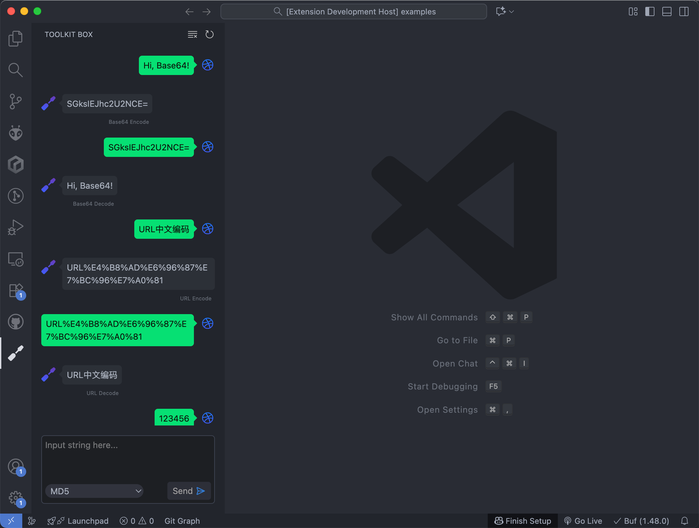

# VSCode Toolkit Box

ToolKit Box for VSCode.

## Features

- Base64 Encode
- Base64 Decode
- URL Encode
- URL Decode
- URL Component Encode
- URL Component Decode
- Encode HTML Entities
- Decode HTML Entities
- Hex Encode
- Hex Decode
- Native -> ASCII
- ASCII -> Native
- Number Base-2
- Number Base-8
- Number Base-16
- Number Base-36
- Number Parse
- ASCII to Decimal
- MD5
- SHA1
- SHA256
- JWT Parse
- JSON Parse
- JSON Stringify
- Date Parse
- String Stats
- Random Bytes
- Arithmetic Operations

## Development

1. `npm run web` start web server
2. Press the `f5` key to run the extension
